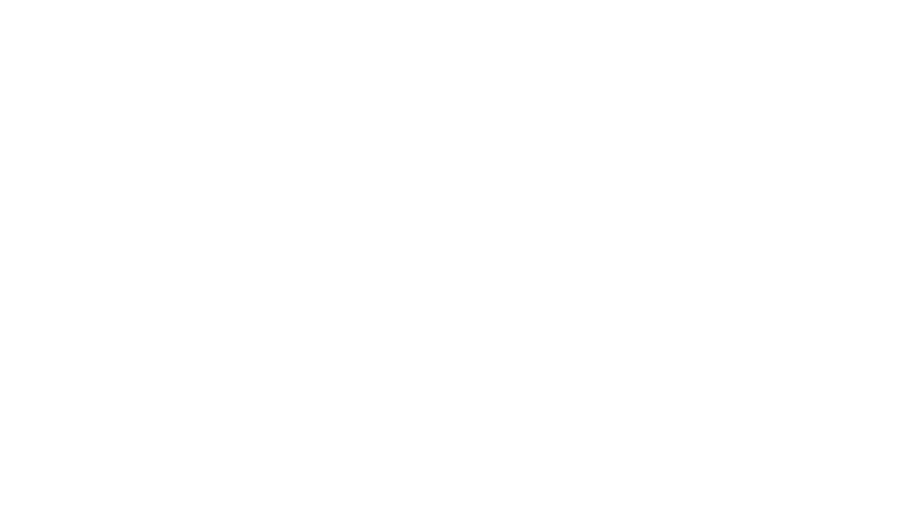

# The Boss Board

**The Boss Board** is a dedicated digital platform designed for the "Digital Mom Boss" community. It serves as a central hub for accessing exclusive resources, networking, and community events, showcasing members in a dynamic, rankable grid.



## 🚀 Features

-   **Home Dashboard**: A dynamic member directory featuring community highlights and resource cards.
-   **Ranking System**: A specialized "Ranking Stars" view to highlight top community contributors.
-   **Community Grid**: A visual card grid layout showcasing members with real-time data from Supabase.
-   **Responsive Design**: Built to work seamlessly on desktop and mobile devices using Tailwind CSS 4.
-   **Efficient Data Fetching**: Powered by React Query for caching and state management.

## 🛠️ Tech Stack

This project is built with a modern frontend stack:

-   **[React 19](https://react.dev/)**: For building a responsive and interactive user interface.
-   **[TypeScript](https://www.typescriptlang.org/)**: To ensure type safety and improved developer experience.
-   **[Vite](https://vitejs.dev/)**: For ultra-fast development and optimized production builds.
-   **[Supabase](https://supabase.com/)**: As the backend provider for database management and real-time features.
-   **[React Query (TanStack)](https://tanstack.com/query/latest)**: For robust server-state management.
-   **[Tailwind CSS 4](https://tailwindcss.com/)**: A utility-first CSS framework for rapid and modern UI development.
-   **[React Router](https://reactrouter.com/)**: For seamless navigation within the SPA.

## 📦 Project Structure

-   `src/api`: API calls and Supabase queries.
-   `src/components`: Reusable UI components categorized into `layout`, `shared`, and `ui`.
-   `src/contexts`: React Context definitions for global state management.
-   `src/helpers`: Utility functions for formatting and data manipulation.
-   `src/hooks`: Custom React hooks for data fetching and logic.
-   `src/lib`: Configuration for external libraries like Supabase.
-   `src/pages`: Main application views (`BossBoardPage`, `RankingStars`).
-   `src/types`: TypeScript interfaces and type definitions.

## 🏁 Getting Started

### Prerequisites

-   Node.js (v18 or higher recommended)
-   npm (or yarn/pnpm)

### Installation

1.  Clone the repository:
    ```bash
    git clone https://github.com/codejoss/thebossboard.git
    cd thebossboard
    ```

2.  Install dependencies:
    ```bash
    npm install
    ```

3.  Configure Environment Variables:
    Create a `.env` file in the root directory and add your Supabase credentials:
    ```env
    VITE_SUPABASE_URL=your_supabase_url
    VITE_SUPABASE_PUBLISHABLE_DEFAULT_KEY=your_supabase_anon_key
    ```

### Available Scripts

-   `npm run dev`: Start the development server.
-   `npm run build`: Build the application for production.
-   `npm run preview`: Preview the production build locally.
-   `npm run lint`: Run ESLint to check for code quality issues.
-   `npm run deploy`: Deploy the `dist/` folder to GitHub Pages.

---

Built with ❤️ by [CodeJoss](https://github.com/codejoss) for Digital Mom Boss.
